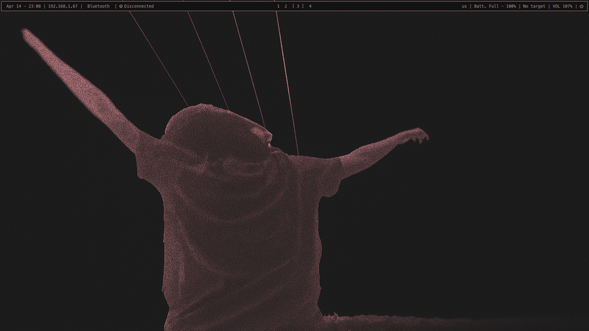
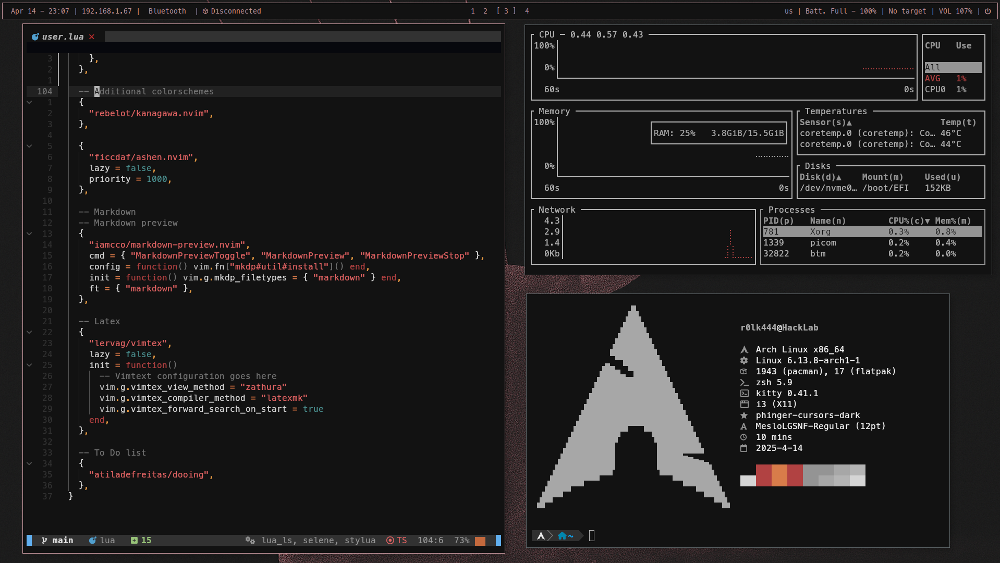

# Dotfiles

## Dependencies
- **WM** :- [**`i3wm`**](https://i3wm.org/)  [**`dunst`**](https://wiki.archlinux.org/title/Dunst)  [**`betterlockscreen`**](https://github.com/betterlockscreen/betterlockscreen)  [**`scrot`**](https://github.com/dreamer/scrot)  [**`picom-arian8j2-git`**](https://aur.archlinux.org/packages/picom-arian8j2-git)  [**`brightnessctl`**](https://archlinux.org/packages/extra/x86_64/brightnessctl/)
- **Utilities** :- [**`polybar`**](https://github.com/polybar/polybar)  [**`rofi`**](https://github.com/adi1090x/rofi)  [**`blueman`**](https://archlinux.org/packages/extra/x86_64/blueman/)
- **Terminal** :- [**`kitty`**](https://sw.kovidgoyal.net/kitty/)  [**`zhs`**](https://wiki.archlinux.org/title/Zsh)  [**`oh my zsh`**](https://ohmyz.sh/)  [**`p10k`**](https://github.com/romkatv/powerlevel10k)  [**`AstroNvim`**](https://astronvim.com/)  [**`bat`**](https://github.com/sharkdp/bat)  [**`lsd`**](https://github.com/lsd-rs/lsd)  [**`zsh-autosugestions`**](https://github.com/zsh-users/zsh-autosuggestions)  [**`zsh-syntax-highlighting`**](https://github.com/zsh-users/zsh-syntax-highlighting)  [**`LazyGit`**](https://github.com/jesseduffield/lazygit)
- **Media** :- [**`nitrogen`**](https://wiki.archlinux.org/title/nitrogen)  [**`feh`**](https://wiki.archlinux.org/title/feh)  [**`thunar`**](https://wiki.archlinux.org/title/thunar) 
- **Fonts** :- [**`ttf-hack-nerd`**](https://archlinux.org/packages/extra/any/ttf-hack-nerd/)  [**`ttf-meslo-nerd`**](https://archlinux.org/packages/extra/any/ttf-meslo-nerd/)  [**`ttf-font-awesome`**](https://archlinux.org/packages/extra/any/ttf-font-awesome/)
